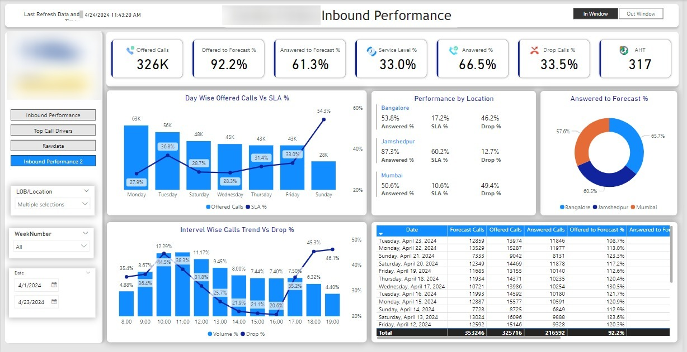
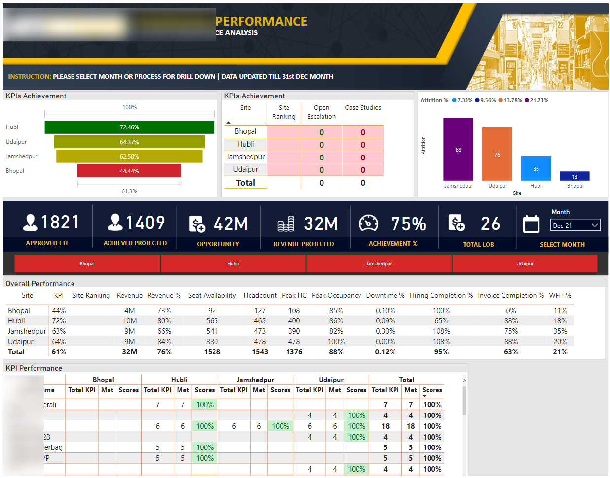
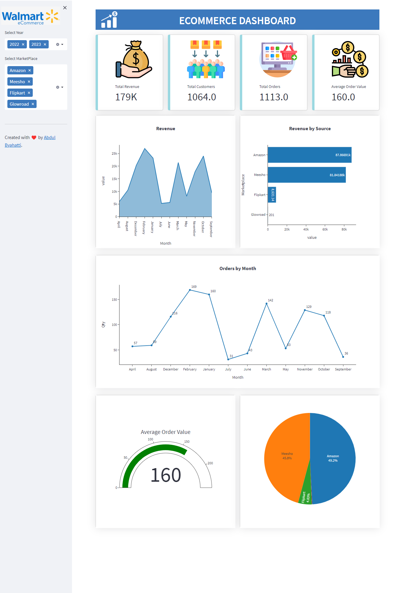
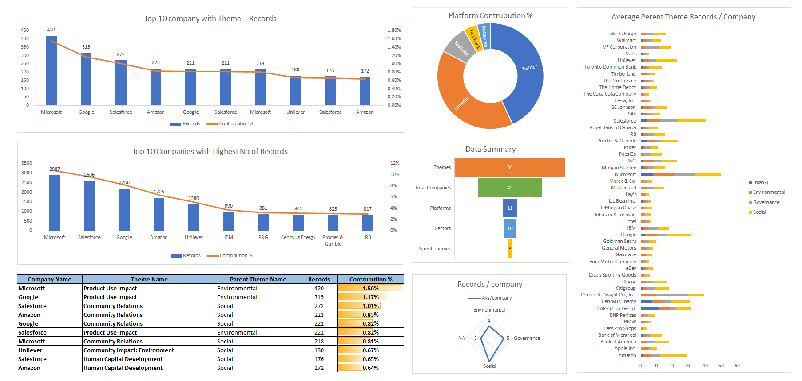
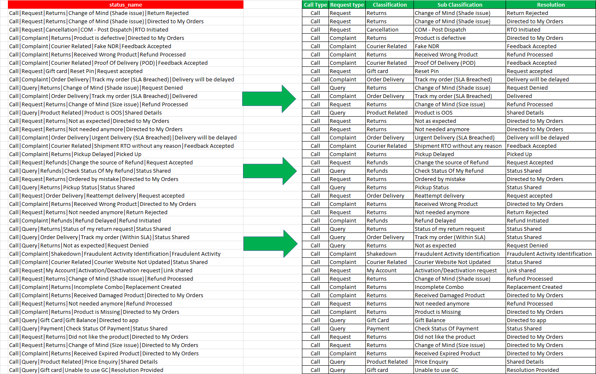

# Hi there, I'm [Abdul Byahatti] 👋

Welcome to my GitHub profile! With over 12 years of experience in data analysis, business intelligence, and automation, I bring a wealth of expertise in Microsoft Excel, Microsoft Office, Power BI, and Python. I'm passionate about transforming data into actionable insights and developing solutions that drive business success.

## 🔧 Skills & Tools

- **Microsoft Excel**: Advanced formulas, pivot tables, data analysis, and visualization.
- **Microsoft Office**: Comprehensive knowledge of Word, Excel, PowerPoint, and Outlook.
- **Power BI**: Data modeling, DAX, Power Query, and interactive dashboards.
- **Python**: Data analysis, automation, and scripting with libraries like Pandas and NumPy.

## 🚀 Projects

Here are some of the projects I’ve worked on:

### 📊 Power BI Call Center Dashboards

### 📊 Power BI Call Center Dashboards

### 🐍 Python Data Analysis

### 📈 Excel Data Analysis

### 📈 Excel Data Clearning

## 📫 Get in Touch

Feel free to reach out if you have any questions or if you're interested in collaborating on a project!

- [LinkedIn](https://www.linkedin.com/in/abdulbyahatti)
- [Email](mailto:excelfunclub@gmail.com)

## 📈 GitHub Stats

Thank you for visiting my profile! I look forward to connecting with you. 😊

